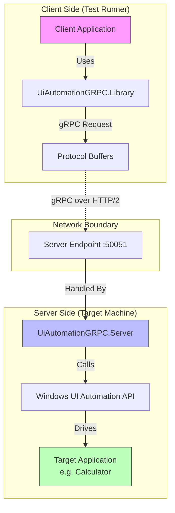

# UiAutomationGRPC

**A generic, decoupled Windows UI Automation framework using gRPC.**

## The Problem
Standard Windows UI Automation code is often tightly coupled to the machine running the automation. This creates challenges for:
-   **Remote Automation**: Driving UI on a separate machine (e.g., a dedicated test rig) from a developer's workstation or CI runner.
-   **Language Interop**: Writing test logic in languages other than C#/.NET (since standard UIA is .NET/COM based).
-   **Separation of Concerns**: Mixing low-level "how to click" logic with high-level "business workflow" logic.

## The Solution
**UiAutomationGRPC** solves this by splitting the automation into two distinct components:

1.  **The Server (Active Driver)**: A Windows Service running on the target machine. It has full access to the Windows desktop and exposes the UI Automation capabilities via a generic gRPC API.
2.  **The Client (Test Controller)**: A lightweight library (SDK) that sends commands to the Server. It can run anywhere network-reachable to the server.

This architecture allows you to write tests that say "Find the button called 'Submit'" without worrying about *how* that command is executed on the specific Windows instance.

## Architecture



## Project Structure

-   **[UiAutomationGRPC.Server](./UiAutomationGRPC.Server)**
    The generic host service. It implements the gRPC definitions and translates them into actual Windows UI Automation calls (e.g., `AutomationElement.Find(...)`). It can be installed as a Windows Service.

-   **[UiAutomationGRPC.Library](./UiAutomationGRPC.Library)**
    The client-side SDK. It hides the complexity of gRPC and provides a clean C# API (e.g., `driver.FindElement(...)`) for developers to write automation scripts.

-   **[UiAutomationGRPC.Client](./UiAutomationGRPC.Client)**
    A sample console application demonstrating how to use the Library to automate the Windows Calculator. It serves as a reference implementation for your own test projects.

## Getting Started

### 1. Requirements
-   **Server Machine**: Windows OS, Administrator privileges (for Service installation).
-   **Development**: .NET Framework 4.7.2 or later.

### 2. Running the Server
You can run the server as a console app for testing, or install it as a service for production.

```powershell
# From UiAutomationGRPC.Server/bin/Debug/net472/
.\UiAutomationGRPC.Server.exe
```

### 3. Writing a Client
Reference `UiAutomationGRPC.Library` in your project and connect to the server:

```csharp
using UiAutomationGRPC.Library;

// Connect to localhost (or remote IP)
using (var driver = new UiAutomationDriver("127.0.0.1:50051"))
{
    // Find generic element
    var calcWindow = driver.FindElement(new SelectorModel 
    { 
        Conditions = new PropertyConditions().NameProperty("Calculator") 
    });
    
    // Interact
    // ...
}
```

See **[UiAutomationGRPC.Client/README.md](./UiAutomationGRPC.Client/README.md)** for a full tutorial.
