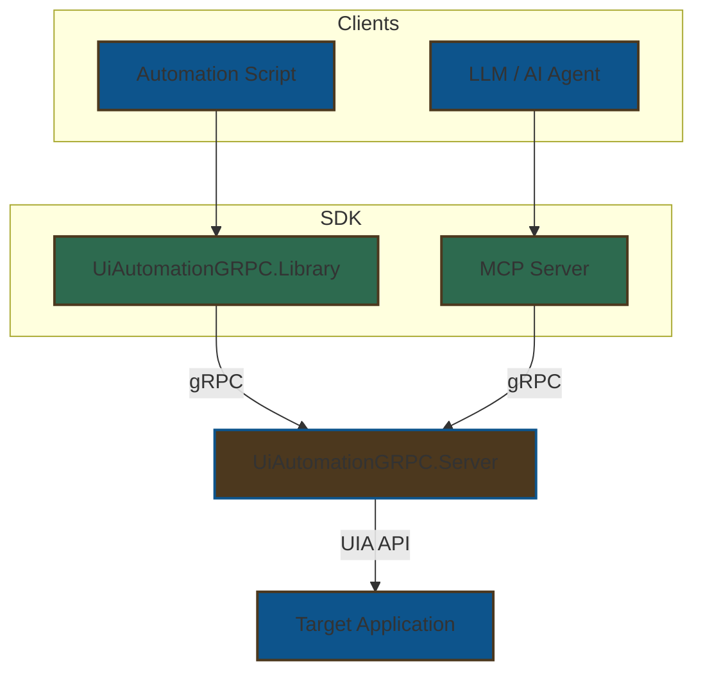

# UiAutomationGRPC

**A generic, decoupled Windows UI Automation framework using gRPC.**

## The Problem

Standard Windows UI Automation code is often tightly coupled to the machine running the automation. This creates challenges for:

- **Remote Automation**: Driving UI on a separate machine (e.g., a dedicated test rig) from a developer's workstation or CI runner.
- **Language Interop**: Writing test logic in languages other than C#/.NET (since standard UIA is .NET/COM based).
- **LLM Integration**: AI agents need a structured way to "see" and interact with applications.

## The Solution

**UiAutomationGRPC** solves this by splitting the automation into distinct components:

1. **Server**: A Windows Service running on the target machine. It exposes UI Automation capabilities via a gRPC API with two approaches:
   - **Direct Element Work**: Fine-grained control for scripts and known UI hierarchies.
   - **App Structure (LLM-Friendly)**: High-level JSON representation for AI-driven automation.
2. **Library**: A .NET 6.0+ client SDK with async/await patterns.
3. **AI Integration**: MCP server for connecting LLMs (Claude, Antigravity) directly to UI automation.

## Architecture


```mermaid
graph TD
    subgraph Clients
        Script[Automation Script]
        LLM[LLM / AI Agent]
    end

    subgraph SDK
        Library[UiAutomationGRPC.Library]
        MCP[MCP Server]
    end

    Script --> Library
    LLM --> MCP
    Library -->|gRPC| Server[UiAutomationGRPC.Server]
    MCP -->|gRPC| Server
    Server -->|UIA API| Target[Target Application]

    classDef client fill:#0d548c,stroke:#4c381e,stroke-width:2px;
    classDef sdk fill:#2d6a4f,stroke:#4c381e,stroke-width:2px;
    classDef server fill:#4c381e,stroke:#0d548c,stroke-width:2px;

    class Script,LLM client;
    class Library,MCP sdk;
    class Server server;
    class Target client;
```

## Project Structure

### [UiAutomationGRPC.Server](./UiAutomationGRPC.Server)

The core gRPC service with **two automation approaches**:

| Approach | Best For | Key Methods |
|----------|----------|-------------|
| **Direct Element Work** | Scripts, known UI | `FindElement`, `GetChildren`, `PerformAction` |
| **App Structure** | LLMs, dynamic exploration | `GetAppStructure`, `PerformActionWithStructure` |

---

### [UiAutomationGRPC.Library](./UiAutomationGRPC.Library)

The client-side SDK for .NET applications.

- **Target**: .NET 6.0+
- **API Style**: Async/await with `UiAutomationDriver`
- **Helpers**: `VirtualMouse`, `VirtualKeyboard` for input simulation

---

### [UiAutomationGRPC.AI](./UiAutomationGRPC.AI)

Tools for AI/LLM integration:

- **[MCP Server](./UiAutomationGRPC.AI/MCP)**: Model Context Protocol server exposing tools (`open_app`, `get_app_structure`, `perform_action`, `perform_action_with_structure`, `close_app`, `clear_cache`) for Claude/Antigravity.
- **[Skill](./UiAutomationGRPC.AI/Skill)**: Pre-built skill definitions for AI assistants.

---

### [UiAutomationGRPC.Client](./UiAutomationGRPC.Client)

Sample console application demonstrating Calculator automation. Reference implementation for your own projects.

## Getting Started

### 1. Requirements

| Component | Requirement |
|-----------|-------------|
| **Server** | Windows OS, .NET Framework 4.7.2, Administrator privileges |
| **Library** | .NET 6.0+ |
| **MCP** | .NET 8 SDK |

### 2. Running the Server

```powershell
cd UiAutomationGRPC.Server
dotnet run
```

Default endpoint: `localhost:50051`

### 3. Using the Library

```csharp
using UiAutomationGRPC.Library;

await using var driver = new UiAutomationDriver("http://127.0.0.1:50051", insecureMode: true);

// Open an application
var (success, message, processId) = await driver.OpenAppAsync("calc");

// Find and interact with elements
var element = await driver.FindElementAsync(new FindElementRequest
{
    Condition = new Condition
    {
        PropertyCondition = new PropertyCondition
        {
            PropertyName = "AutomationId",
            PropertyValue = "num9Button"
        }
    },
    Scope = TreeScope.Descendants
});

await driver.PerformActionAsync(element.RuntimeId, ActionType.Invoke);
```

### 4. LLM Integration (MCP)

Configure your MCP client to run the server:

```powershell
dotnet run --project UiAutomationGRPC.AI/MCP
```

The LLM can then use the "See → Think → Act" loop:
1. `get_app_structure` - See the current UI state
2. Analyze and decide on the next action
3. `perform_action_with_structure` - Act and get updated state

## Security

The server supports three security modes, configured via `appsettings.json`:

| Mode | Encryption | Authentication | Use Case |
|------|-----------|----------------|----------|
| **Insecure** (default) | ❌ HTTP | ❌ None | Local development |
| **HTTPS** | ✅ TLS | ❌ None | Encrypted communication |
| **HTTPS + Token** | ✅ TLS | ✅ Bearer token | Production |

Clients (Library and MCP) must match the server's security mode:

```csharp
// Insecure mode (development)
await using var driver = new UiAutomationDriver("http://127.0.0.1:50051", insecureMode: true);

// HTTPS + token authentication (production)
await using var driver = new UiAutomationDriver("https://127.0.0.1:50051", authToken: "your-token");
```

> See [Server README](./UiAutomationGRPC.Server/README.md#security) for full configuration details.

## Documentation

- [Server README](./UiAutomationGRPC.Server/README.md) - Detailed API, security, and configuration
- [Library README](./UiAutomationGRPC.Library/README.md) - SDK usage guide
- [AI README](./UiAutomationGRPC.AI/README.md) - AI/LLM integration overview
- [MCP README](./UiAutomationGRPC.AI/MCP/README.md) - MCP server setup
- [Client README](./UiAutomationGRPC.Client/README.md) - Example walkthrough
