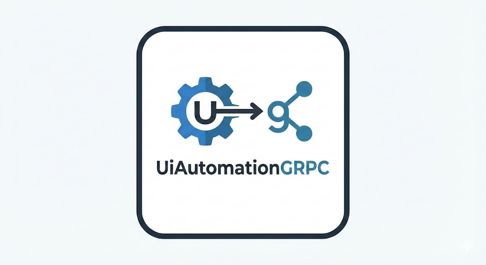
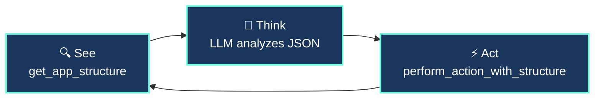
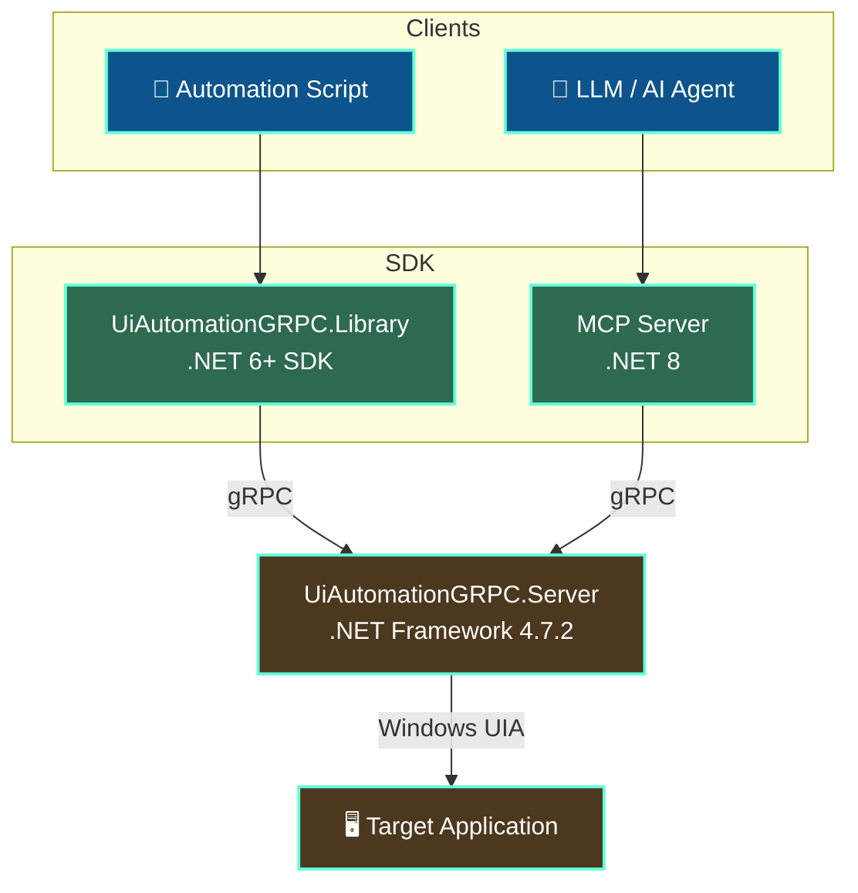

<p align="center">
  
</p>

<h3 align="center">Drive any Windows desktop application through AI agents or code — over gRPC</h3>

<p align="center">
  <a href="https://github.com/Donsezan/UiAutomationGRPC/actions"></a>
  
  
  
  
  <a href="LICENSE"></a>
</p>

---

## ✨ Key Features

- **AI-Ready** — purpose-built JSON app structure for LLM agents (`See → Think → Act` loop)
- **Remote Automation** — drive UI on any Windows machine from anywhere via gRPC
- **Language Agnostic** — any language with a gRPC client can automate Windows apps
- **MCP Server** — plug-and-play integration with Model Context Protocol clients
- **Full UI Control** — click, type, scroll, screenshot, read properties, navigate trees
- **Enterprise Security** — TLS encryption, Bearer-token authentication, rate limiting, app whitelist/blacklist
- **Element Caching** — live-validated cache with scoped invalidation by process or app name

---

## 🤖 LLM Agent Integration

UiAutomationGRPC gives AI agents **structured vision** into Windows applications. Instead of relying on screenshots and pixel coordinates, the agent receives a semantic JSON tree of every UI element — names, types, automation IDs, and bounding rectangles — and acts on them by ID.

### Supported Agents

| Agent | Integration | Notes |
|-------|-------------|-------|
| **Claude Desktop** (Anthropic) | MCP Server | First-class MCP tool support |
| **Google Antigravity** | MCP Server / Skill | MCP tools + pre-built Skill definition |
| **OpenAI Codex / ChatGPT** | MCP / Programmatic | Via MCP bridge or direct gRPC SDK |
| **Cursor** | MCP Server | Native MCP client support |
| **Windsurf** (Codeium) | MCP Server | Native MCP client support |
| **Custom Agents** | gRPC SDK | Any language — Python, TypeScript, Go, Rust, … |

### How It Works: See → Think → Act


```mermaid
graph LR
    A["🔍 See<br/>get_app_structure"] --> B["🧠 Think<br/>LLM analyzes JSON"]
    B --> C["⚡ Act<br/>perform_action_with_structure"]
    C --> A

    classDef step fill:#1a365d,stroke:#64ffda,stroke-width:2px,color:#fff;
    class A,B,C step;
```

1. **See** — `get_app_structure` returns the full UI hierarchy as a JSON tree
2. **Think** — the LLM identifies target elements by name, type, or automation ID
3. **Act** — `perform_action_with_structure` executes the action **and** returns the refreshed tree in one call

### Example (MCP Tool Calls)

```
User: "Open Calculator and compute 42 × 7"

1. open_app(app_name="calc")
2. get_app_structure(app_name="calc")         → JSON tree
3. LLM: "I see buttons: Four, Two, Multiply, Seven, Equals"
4. perform_action_with_structure("num4Button", "INVOKE")  → click 4, get new tree
5. perform_action_with_structure("num2Button", "INVOKE")  → click 2
6. perform_action_with_structure("multiplyButton", "INVOKE")
7. perform_action_with_structure("num7Button", "INVOKE")
8. perform_action_with_structure("equalButton", "INVOKE")
9. LLM reads result from updated structure: "294"
```

---

## 💻 Programmatic Automation

For traditional scripting and test automation, the .NET SDK provides a full async API.

### Quick Example

```csharp
using UiAutomationGRPC.Library;

await using var driver = new UiAutomationDriver("http://127.0.0.1:50051", insecureMode: true);

// Launch an application
var (success, message, processId) = await driver.OpenAppAsync("calc");

// Find an element by AutomationId
var element = await driver.FindElementAsync(new FindElementRequest
{
    Condition = new Condition
    {
        PropertyCondition = new PropertyCondition
        {
            PropertyName = "AutomationId",
            PropertyValue = "num9Button"
        }
    },
    Scope = TreeScope.Descendants
});

// Interact
await driver.PerformActionAsync(element.RuntimeId, ActionType.Invoke);

// Virtual input helpers
var keyboard = new VirtualKeyboard(driver);
await keyboard.SendWaitAsync("2+2=");

var mouse = new VirtualMouse(driver);
await mouse.LeftClickAsync(element.RuntimeId);
```

### Install via NuGet

```bash
dotnet add package UiAutomationGRPC
```

---

## 🏗️ Architecture


```mermaid
graph TD
    subgraph Clients
        Script["📝 Automation Script"]
        LLM["🤖 LLM / AI Agent"]
    end

    subgraph SDK
        Library["UiAutomationGRPC.Library<br/>.NET 6+ SDK"]
        MCP["MCP Server<br/>.NET 8"]
    end

    Script --> Library
    LLM --> MCP
    Library -->|gRPC| Server["UiAutomationGRPC.Server<br/>.NET Framework 4.7.2"]
    MCP -->|gRPC| Server
    Server -->|Windows UIA| Target["🖥️ Target Application"]

    classDef client fill:#0d548c,stroke:#64ffda,stroke-width:2px,color:#fff;
    classDef sdk fill:#2d6a4f,stroke:#64ffda,stroke-width:2px,color:#fff;
    classDef server fill:#4c381e,stroke:#64ffda,stroke-width:2px,color:#fff;

    class Script,LLM client;
    class Library,MCP sdk;
    class Server,Target server;
```

---

## 📦 Project Structure

| Component | Description | Target |
|-----------|-------------|--------|
| [**UiAutomationGRPC.Server**](./UiAutomationGRPC.Server) | Core gRPC service — exposes Windows UI Automation over the network | .NET Framework 4.7.2 |
| [**UiAutomationGRPC.Library**](./UiAutomationGRPC.Library) | .NET client SDK — `UiAutomationDriver`, `VirtualMouse`, `VirtualKeyboard` | .NET 6.0+ |
| [**UiAutomationGRPC.AI**](./UiAutomationGRPC.AI) | AI integration — MCP Server + Skill definitions for LLM agents | .NET 8 |
| [**UiAutomationGRPC.Client**](./UiAutomationGRPC.Client) | Sample console app — Calculator automation reference implementation | .NET 6.0+ |


### Two Automation Approaches

| | Direct Element Work | App Structure (LLM-Friendly) |
|---|---|---|
| **API** | `FindElement`, `GetChildren`, `PerformAction` | `GetAppStructure`, `PerformActionWithStructure` |
| **Best For** | Scripts, known UI hierarchies | LLMs, dynamic exploration |
| **Overhead** | Low | Higher (builds JSON tree) |
| **State** | Per-element | Full application |

### Available Actions

| Action | Description |
|--------|-------------|
| `Invoke` | Click / activate |
| `Toggle` | Checkboxes, switches |
| `SetValue` | Set text in input fields |
| `Select` | Select list items |
| `SetFocus` | Focus an element |
| `ExpandCollapse` | Expand / collapse tree nodes, menus |
| `LeftClick` / `RightClick` / `DoubleClick` | Simulated mouse clicks |
| `MoveTo` | Move mouse to element center |
| `MouseMoveAbs` / `MouseMoveRel` | Absolute / relative mouse movement |
| `MouseClickAt` | Click at screen coordinates |
| `SendKeys` | Send keyboard input |
| `SendKeyCombination` | Send key combinations (e.g., `Ctrl+S`) |
| `TakeScreenshot` | Capture screen or window |

---

## 🚀 Getting Started

### 1. Prerequisites

| Component | Requirement |
|-----------|-------------|
| **Server** | Windows, .NET Framework 4.7.2, Administrator privileges |
| **Library** | .NET 6.0+ |
| **MCP** | .NET 8 SDK |

### 2. Start the Server

```powershell
cd UiAutomationGRPC.Server
dotnet run
```

Default endpoint: `localhost:50051`

### 3a. Use via .NET SDK

```csharp
await using var driver = new UiAutomationDriver("http://127.0.0.1:50051", insecureMode: true);
var (success, message, processId) = await driver.OpenAppAsync("notepad");
```

### 3b. Use via MCP (AI Agents)

```powershell
dotnet run --project UiAutomationGRPC.AI/MCP
```

Then configure your MCP client (Claude Desktop, Antigravity, Cursor, Windsurf) to connect to the MCP server. The agent can immediately start the **See → Think → Act** loop.

---

## 🔒 Security

Three security modes, configured in `appsettings.json`:

| Mode | Encryption | Authentication | Use Case |
|------|-----------|----------------|----------|
| **Insecure** (default) | ❌ HTTP | ❌ None | Local development |
| **HTTPS** | ✅ TLS | ❌ None | Encrypted communication |
| **HTTPS + Token** | ✅ TLS | ✅ Bearer token | Production |

```csharp
// Development
await using var driver = new UiAutomationDriver("http://127.0.0.1:50051", insecureMode: true);

// Production
await using var driver = new UiAutomationDriver("https://127.0.0.1:50051", authToken: "your-token");
```

Additional security features:
- **Rate Limiting** — configurable per-second, per-minute, and concurrent connection limits
- **App Whitelist / Blacklist** — restrict which applications the server can launch

> See [Server README](./UiAutomationGRPC.Server/README.md#security) for full configuration details.

---

## 📖 Documentation

| Document | Contents |
|----------|----------|
| [Server README](./UiAutomationGRPC.Server/README.md) | API reference, security, configuration, installation |
| [Library README](./UiAutomationGRPC.Library/README.md) | SDK usage guide, API reference, input helpers |
| [AI README](./UiAutomationGRPC.AI/README.md) | AI/LLM integration overview |
| [MCP README](./UiAutomationGRPC.AI/MCP/README.md) | MCP server setup & tool documentation |
| [Client README](./UiAutomationGRPC.Client/README.md) | Calculator automation walkthrough |

---

## 📄 License

This project is licensed under the [Apache License 2.0](LICENSE).
