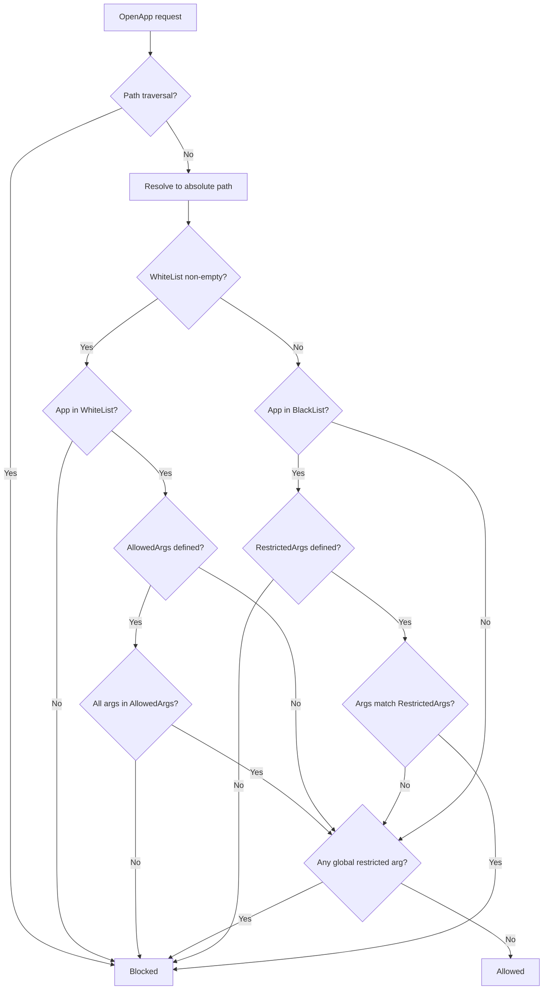
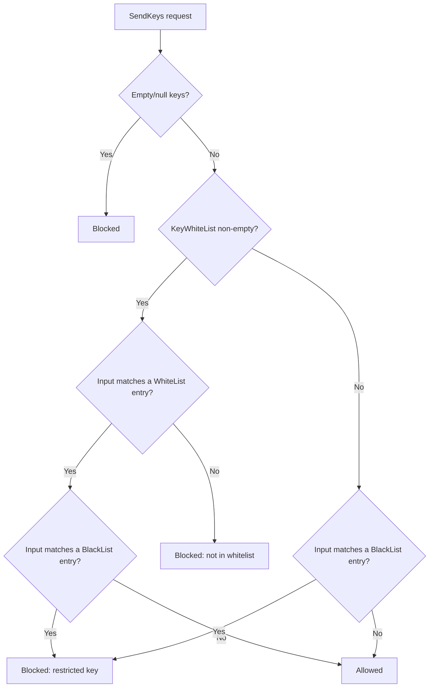

# UiAutomationGRPC.Server

A gRPC-based Windows UI Automation service that enables programmatic control of desktop applications. This server provides two distinct approaches for interacting with UI elements.

## Two Approaches for UI Automation

### Approach 1: Direct Element Work

This approach provides fine-grained control over individual UI elements. You manually navigate the element tree and perform actions directly.

**Flow:**
1. `FindElement` - Locate an element by property conditions (Name, AutomationId, ControlType, etc.)
2. `GetChildren` - Navigate the element tree to discover child elements
3. `PerformAction` - Execute actions on elements using their cached RuntimeId
4. `GetProperty` - Read element properties

**Use Cases:**
- Building custom automation scripts with precise control
- Scenarios where you know the exact element hierarchy
- Performance-critical automation (minimal overhead)

**Example Flow:**
```
1. FindElement(ControlType=Window, Name="Calculator")
   → Returns element with RuntimeId="..."
2. GetChildren(RuntimeId="...")
   → Returns list of child elements
3. FindElement(AutomationId="num9Button")
   → Returns button element
4. PerformAction(RuntimeId="...", Action=Invoke)
   → Clicks the button
```

---

### Approach 2: App Structure (LLM-Friendly)

This approach provides a high-level JSON representation of the application's UI tree, ideal for AI/LLM interaction where the agent needs to "see" the entire application state.

**Flow:**
1. `GetAppStructure` - Returns complete UI hierarchy as JSON
2. `PerformActionWithStructure` - Performs action AND returns updated structure

**Key Methods:**

| Method | Description |
|--------|-------------|
| `GetAppStructure` | Returns JSON tree with all visible elements, their IDs, names, control types, and bounding rectangles |
| `PerformActionWithStructure` | Performs an action and returns the refreshed app structure in a single call |

**Use Cases:**
- LLM-driven automation ("See → Think → Act" loop)
- Dynamic UI exploration
- Situations where UI changes frequently after actions

**Example Flow (LLM Loop):**
```
1. GetAppStructure(AppName="Calculator")
   → Returns JSON:
   {
     "Name": "Calculator",
     "RuntimeId": "42.123456",
     "ControlType": "Window",
     "Children": [
       { "Name": "Nine", "AutomationId": "num9Button", ... },
       ...
     ]
   }

2. LLM analyzes structure, decides to click "num9Button"

3. PerformActionWithStructure(RuntimeId="...", Action=Invoke)
   → Performs click AND returns updated structure

4. Repeat: LLM sees new state, decides next action
```

---

## Comparison

| Feature | Direct Element Work | App Structure |
|---------|---------------------|---------------|
| Overhead | Low | Higher (builds JSON tree) |
| Best For | Scripts, known UI | LLMs, dynamic exploration |
| Navigation | Manual (FindElement/GetChildren) | Automatic (full tree) |
| State Awareness | Per-element | Full application |
| Response | Single element | JSON tree |

## Available Actions

Both approaches support these actions via `PerformAction`:

- **Invoke** - Click/activate an element
- **Toggle** - Toggle checkboxes, switches
- **SetValue** - Set text in input fields
- **Select** - Select items in lists
- **SetFocus** - Focus an element
- **ExpandCollapse** - Expand/collapse tree nodes, menus
- **LeftClick** / **RightClick** / **DoubleClick** - Simulated mouse clicks
- **MoveTo** - Move mouse to element center

### Global Mouse Actions (no element required)

These act at the current cursor position or at absolute coordinates, simulated via `VirtualMouse`:

- **Move** - Move the cursor to absolute screen coordinates
- **LeftClick** / **RightClick** / **MouseMiddleClick** - Click at the cursor position
- **LeftDown** / **LeftUp** / **RightDown** / **RightUp** - Press/release a mouse button
- **MousWeelScroll** - Scroll the mouse wheel

## Other Endpoints

| Method | Description |
|--------|-------------|
| `OpenApp` | Launch an application by path or name (gated by the app WhiteList/BlackList) |
| `CloseApp` | Terminate all processes matching an app name |
| `CloseAppByProcessId` | Terminate a single process by PID |
| `SendKeys` | Send keyboard input to the focused element (gated by key restrictions) |
| `TakeScreenshot` | Capture an element or window screenshot |
| `Reflect` | Advanced: query UI Automation properties, patterns, and control types dynamically |
| `ClearCache` | Clear element cache — all, by process ID, or by app name |

---

## Prerequisites

- Windows with the .NET 8 SDK (the project targets `net8.0-windows`)
- Administrator privileges (UI Automation access to many target apps requires elevation)

## Running

```powershell
# Console app (default endpoint http://0.0.0.0:50051)
dotnet run --project UiAutomationGRPC.Server
```

## Installation

To install as a Windows Service, run in an Administrator PowerShell:

```powershell
sc create UiAutomationService binPath= "C:\path\to\UiAutomationGRPC.Server.exe" start= auto
```

*Replace with the actual path to the executable.*

## Management

```powershell
# Start
sc start UiAutomationService

# Stop
sc stop UiAutomationService

# Delete
sc delete UiAutomationService
```

## Configuration

All configuration is done via `appsettings.json`:

```json
{
  "Security": {
    "Enabled": false,
    "CertificatePath": "server.pfx",
    "CertificatePassword": "",
    "TokenAuthEnabled": false,
    "ValidTokens": [],
    "Port": 50051
  },
  "WhiteList": [],
  "BlackList": []
}
```

### Security Settings

| Setting | Type | Default | Description |
|---------|------|---------|-------------|
| `Security:Enabled` | bool | `false` | Enable HTTPS with TLS certificate |
| `Security:CertificatePath` | string | `"server.pfx"` | Path to the PFX certificate file |
| `Security:CertificatePassword` | string | `""` | Password for the PFX certificate |
| `Security:TokenAuthEnabled` | bool | `false` | Enable Bearer token authentication |
| `Security:ValidTokens` | string[] | `[]` | List of accepted tokens |
| `Security:Port` | int | `50051` | gRPC listening port |

> [!NOTE]
> Enabling `TokenAuthEnabled` with an empty `ValidTokens` list is fail-closed: **every** request is rejected as `Unauthenticated`. The server logs a warning at startup when this happens.

## App Access Control (WhiteList / BlackList)

The server can restrict which applications `OpenApp` is allowed to launch via WhiteList and BlackList rules in `appsettings.json`. When `RestrictInteractions` is `true` (the default), the **same** lists also gate interactions with already-running processes — element operations, `GetAppStructure`, and process termination (`CloseApp` / `CloseAppByProcessId`). If no lists are configured, all applications are allowed by default.

### Evaluation Logic



**Key behaviours:**

- **Path resolution** — the requested app name is resolved to an absolute path (local file → current directory → system `PATH` via `where.exe`). If it cannot be resolved, the request is denied.
- **Traversal blocking** — any path containing `..` segments is rejected outright.
- **WhiteList mode** — when at least one `WhiteList` entry has a non-empty `Path`, *only* those applications are permitted. Everything else is denied.
- **BlackList mode** — when no WhiteList is present, all apps are permitted *except* those explicitly blacklisted.
- **Argument filtering** — both WhiteList (`AllowedArgs`) and BlackList (`RestrictedArgs`) support per-app argument control.
- **Global restricted args** — BlackList entries with an **empty** `Path` apply their `RestrictedArgs` globally to every application.

### Configuration

Add `WhiteList` and/or `BlackList` as **top-level** arrays in `appsettings.json` (not under `Features`), alongside the optional `RestrictInteractions` flag:

```json
{
  "RestrictInteractions": true,
  "WhiteList": [
    {
      "Path": "C:\\Program Files\\MyApp\\app.exe",
      "AllowedArgs": ["--safe-flag"]
    }
  ],
  "BlackList": [
    {
      "Path": "C:\\Windows\\System32\\cmd.exe",
      "RestrictedArgs": []
    },
    {
      "Path": "",
      "RestrictedArgs": ["--admin", "--debug"]
    }
  ]
}
```

| Setting | Type | Default | Description |
|---------|------|---------|-------------|
| `RestrictInteractions` | bool | `true` | When `true`, the WhiteList/BlackList also gates interactions with running processes, not just `OpenApp`. When `false`, only app launch is restricted. |

### App Access Settings

#### WhiteList Entry

| Property | Type | Description |
|----------|------|-------------|
| `Path` | string | Absolute path to the allowed executable |
| `AllowedArgs` | string[] | If non-empty, only these arguments may be passed. Empty list means any arguments are allowed |

#### BlackList Entry

| Property | Type | Description |
|----------|------|-------------|
| `Path` | string | Absolute path to the blocked executable. **Empty** = global rule |
| `RestrictedArgs` | string[] | If non-empty, only these arguments are blocked for the app. Empty list = entire app is blocked |

### Example Scenarios

#### WhiteList-only — permit specific apps

```json
{
  "WhiteList": [
    { "Path": "C:\\Tools\\calculator.exe", "AllowedArgs": [] },
    { "Path": "C:\\Tools\\editor.exe",     "AllowedArgs": ["--readonly"] }
  ]
}
```

Only `calculator.exe` (any args) and `editor.exe` (only `--readonly`) can be launched.

#### BlackList-only — block specific apps or args

```json
{
  "BlackList": [
    { "Path": "C:\\Windows\\System32\\cmd.exe",        "RestrictedArgs": [] },
    { "Path": "C:\\Windows\\System32\\powershell.exe",  "RestrictedArgs": ["-ExecutionPolicy"] },
    { "Path": "",                                       "RestrictedArgs": ["--admin"] }
  ]
}
```

- `cmd.exe` is blocked entirely.
- `powershell.exe` is allowed except when `-ExecutionPolicy` is passed.
- The `--admin` argument is blocked for **all** applications.

#### Combined — WhiteList + global BlackList args

```json
{
  "WhiteList": [
    { "Path": "C:\\Tools\\app.exe", "AllowedArgs": [] }
  ],
  "BlackList": [
    { "Path": "", "RestrictedArgs": ["--unsafe"] }
  ]
}
```

Only `app.exe` may launch, and even for this app the `--unsafe` argument is rejected.

> [!CAUTION]
> Without any WhiteList or BlackList configuration, `OpenApp` can launch **any** executable. For production deployments, always configure at least a WhiteList to restrict allowed applications.

---

## Key Restriction (SendKeys Filter)

The server can restrict which keyboard input the `SendKeys` endpoint is allowed to execute via `KeyRestrictions` WhiteList and BlackList rules in `appsettings.json`. If no lists are configured, all key input is allowed by default.

### Evaluation Logic



**Key behaviours:**

- **WhiteList mode** — when at least one `KeyWhiteList` entry exists, *only* matching key inputs are permitted. Everything else is denied.
- **BlackList mode** — when no WhiteList is present, all keys are permitted *except* those matching a BlackList entry.
- **Combined** — WhiteList + BlackList can be used together. WhiteList is checked first, then BlackList applies as a secondary filter.
- **BlackList matching** — uses **substring containment** (case-insensitive). Blacklisting `%{F4}` also blocks `abc%{F4}xyz`.
- **WhiteList matching** — uses **exact match** (case-insensitive), except for the `{PLAINTEXT}` token.

### The `{PLAINTEXT}` Token

When `{PLAINTEXT}` appears in the WhiteList, it matches any input containing **only regular printable characters** — no modifiers (`^`, `%`, `+`, `~`) and no special key codes (`{ENTER}`, `{F4}`, etc.).

This makes it easy to allow regular typing while blocking all modifier combinations:

```json
"WhiteList": ["{PLAINTEXT}", "{ENTER}", "{TAB}", "{BACKSPACE}"]
```

### Configuration

Add `KeyRestrictions` under the `Features` section in `appsettings.json`:

```json
{
  "Features": {
    "KeyRestrictions": {
      "WhiteList": [],
      "BlackList": []
    }
  }
}
```

### Key Restriction Settings

| Property | Type | Default | Description |
|----------|------|---------|-------------|
| `WhiteList` | string[] | `[]` | When non-empty, only these key patterns are allowed. Supports `{PLAINTEXT}` token |
| `BlackList` | string[] | `[]` | Key patterns to block. Uses substring containment matching |

### Common Dangerous Key Combinations

| Combination | SendKeys format | Risk |
|------------|----------------|------|
| Alt+F4 | `%{F4}` | Closes active window |
| Ctrl+Esc | `^{ESC}` | Opens Start menu |
| Alt+Tab | `%{TAB}` | Switches windows |
| Ctrl+Alt+Delete | `^%{DELETE}` | System security screen |
| Ctrl+Shift+Esc | `^+{ESC}` | Opens Task Manager |
| Alt+Space | `% ` | Opens window system menu |

### Example Scenarios

#### WhiteList — allow only regular typing and basic navigation

```json
{
  "Features": {
    "KeyRestrictions": {
      "WhiteList": ["{PLAINTEXT}", "{ENTER}", "{TAB}", "{BACKSPACE}", "{DELETE}", "{LEFT}", "{RIGHT}", "{UP}", "{DOWN}"],
      "BlackList": []
    }
  }
}
```

All modifier combinations (`Ctrl+C`, `Alt+F4`, etc.) are blocked. Only plain text and explicitly listed special keys are allowed.

#### BlackList — block specific dangerous combinations

```json
{
  "Features": {
    "KeyRestrictions": {
      "WhiteList": [],
      "BlackList": ["%{F4}", "^{ESC}", "%{TAB}", "^%{DELETE}", "^+{ESC}"]
    }
  }
}
```

All keys are allowed except the listed dangerous combinations.

#### Combined — allow typing, whitelist some combos, blacklist others

```json
{
  "Features": {
    "KeyRestrictions": {
      "WhiteList": ["{PLAINTEXT}", "{ENTER}", "^c", "^v", "^a"],
      "BlackList": []
    }
  }
}
```

Allows plain text, Enter, and Ctrl+C/V/A. All other modifier combinations are blocked by the whitelist.

> [!CAUTION]
> Without any KeyRestrictions configuration, `SendKeys` can execute **any** key combination. For production deployments, configure at least a BlackList of dangerous key patterns or a WhiteList to restrict allowed input.

---

## Security

The server supports three security modes:

### 1. Insecure Mode (Default)

No encryption, no authentication — suitable for local development.

```json
{
  "Security": {
    "Enabled": false,
    "Port": 50051
  }
}
```

Endpoint: `http://localhost:50051`

### 2. HTTPS with Certificate

Encrypted connections using a TLS certificate.

```json
{
  "Security": {
    "Enabled": true,
    "CertificatePath": "server.pfx",
    "CertificatePassword": "your-password",
    "Port": 50051
  }
}
```

Endpoint: `https://localhost:50051`

### 3. HTTPS + Token Authentication

Encrypted connections with Bearer token validation on every request.

```json
{
  "Security": {
    "Enabled": true,
    "CertificatePath": "server.pfx",
    "CertificatePassword": "your-password",
    "TokenAuthEnabled": true,
    "ValidTokens": ["your-secret-token"],
    "Port": 50051
  }
}
```

Clients must send an `Authorization: Bearer <token>` header with every gRPC call.

> ⚠️ **Warning**: Insecure mode should only be used for local development. Production deployments should use HTTPS with token authentication.

## Logging

Logs are written to Windows Event Viewer under the **Application** log.

## Troubleshooting

- Check Windows Event Log for startup errors
- Ensure port **50051** is not in use
- Run as Administrator for UI Automation access
- If HTTPS is enabled, verify the certificate file exists at the configured path
